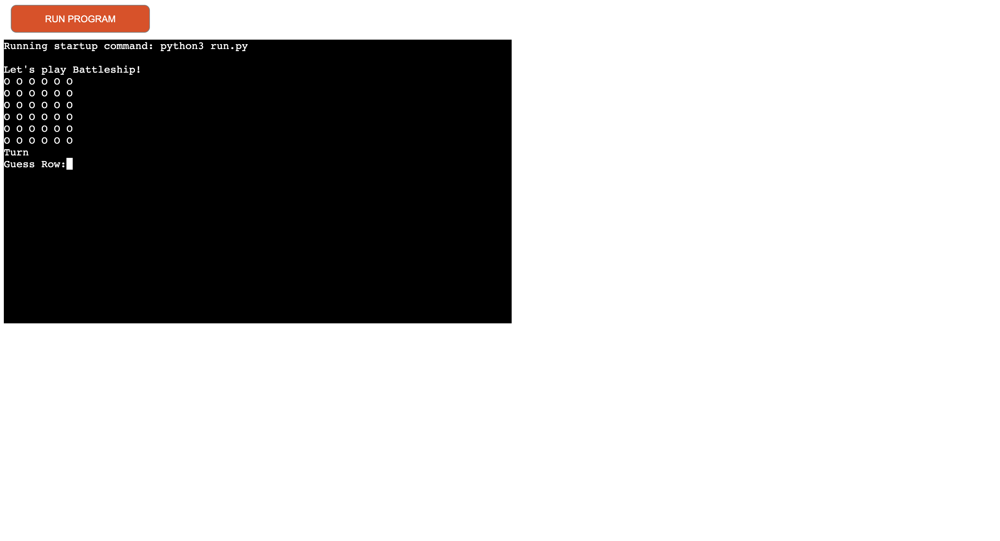
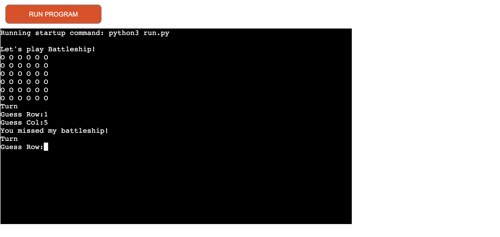
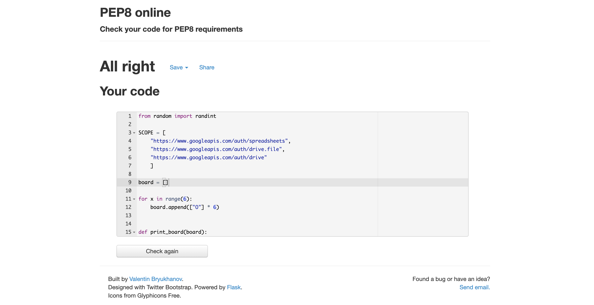

# Sea Battle 

Sea Battle otherwise known as Battleship is Python terminal based interactive game
where the user attemps to sink a battleship by competing with a computer.

[Please see the live version of the project](https://ocean-battle.herokuapp.com)

## How to Play 

You can find the origins and rules to play the game through [Wikipidea.](https://en.wikipedia.org/wiki/Battleship_(game))

In this version of Sea Battle (Battleship) the player will be given 
the option to choose a number for a Row and Column.They will enter 
this number and be told if they have sunk the shape.This is a much simpler version
of the original game.

## Features 

### Existing Features

- Random Selection 
- The player is unaware of where the sink is 

  
- Computer is played against

- Input validation and error checking 

 You are met with an error message if you enter numbers outside of the grid
 You must enter a numerical value 

 ### Future Features 

 - Create ships on grid and allow user to orienate them
 - Create live score board

 ## Testing 

- Code was passed through the Pep8 Python validator and 
reported no issues
- Tested in my local terminal and the code institute Heroku terminal

## Deployment 

My project was deployed using Code Institue's mock terminal for Heroku 

The following steps were taken to deploy this.

1. Clone this Repository 
2. Create Heroku App
3. Adjust buildbacks to Python and NodeJS - specifically in this order.
4. Bond the Heroku app to the respository 
5. Click on Deploy.

## Credits 

- Wikipidiea for link for further information on the game.

